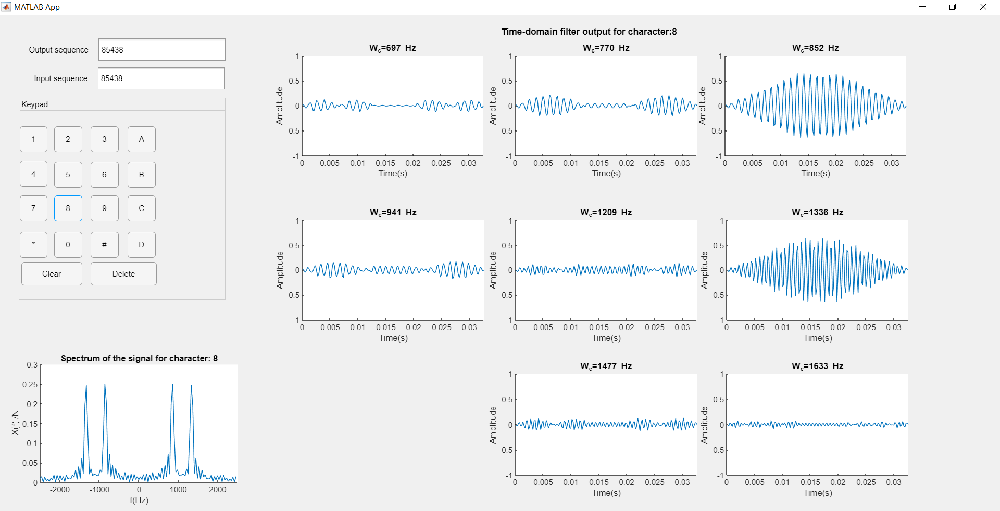

# Dual Tone Multi Frequency(DTMF) Coder and Decoder

Designed a Dual Tone Multi Frequency(DTMF) encoder and decoder from scratch using MATLAB. The DTMF system uses a set of 8 Audio frequencies transmitted in pairs to represent 16 signals, represented by the ten digits, the letters A to D, and the symbols # and \*

**Folder structure:**

- App_code.m: Code for running the GUI App
- Report.PDF : Contains detailed report of the entire project and its results

**Software used in this project:** MATLAB

## How to run the Application?

1. Download and install MATLAB from the official website
2. Run the 'App_code.m' in MATLAB software

### App details:

- The GUI has a “Keypad” which is for entering the sequence.
- It also has ‘Clear” button which clears the entire input text field
- The ‘Delete’ button clears one single character from the sequence
- The Time-domain filter output for each of the character is displayed dynamically as we keep entering the individual digits
- A sound corresponding to the signal containing its two frequencies is produced each time a key is pressed. This was done by using the ‘sound’ function of MATLAB
- The frequency spectra of the character which was most recently pressed is shown in the bottom left portion of the app window

### GUI App screenshot

  
